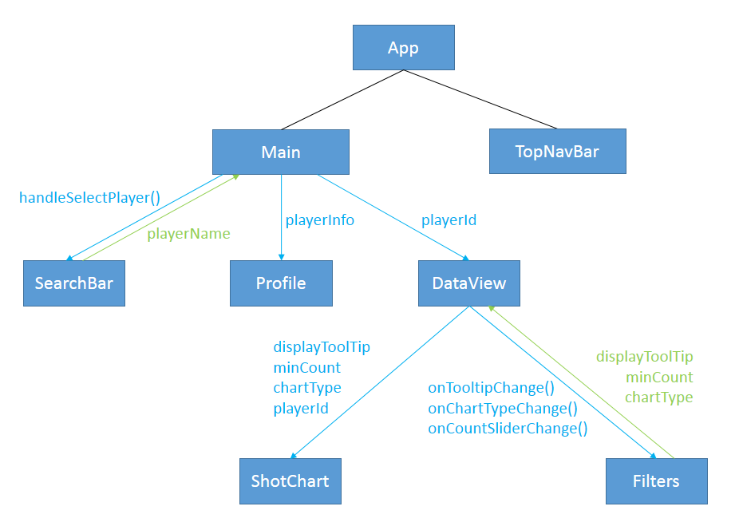
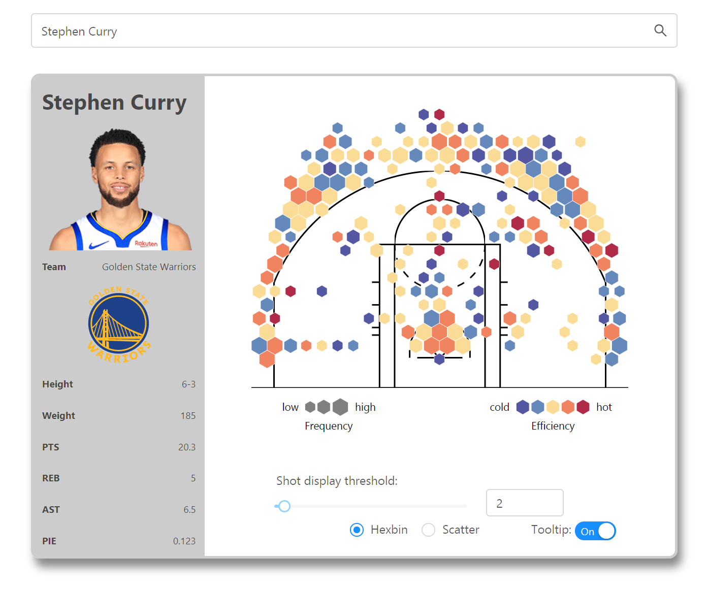
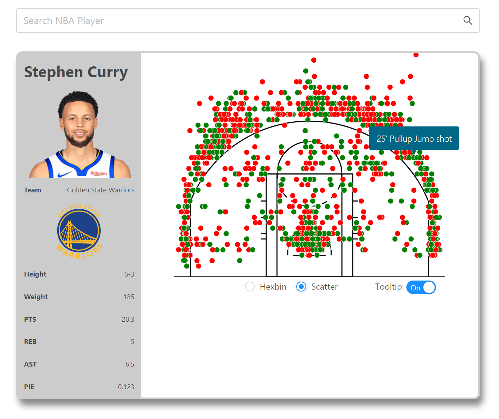
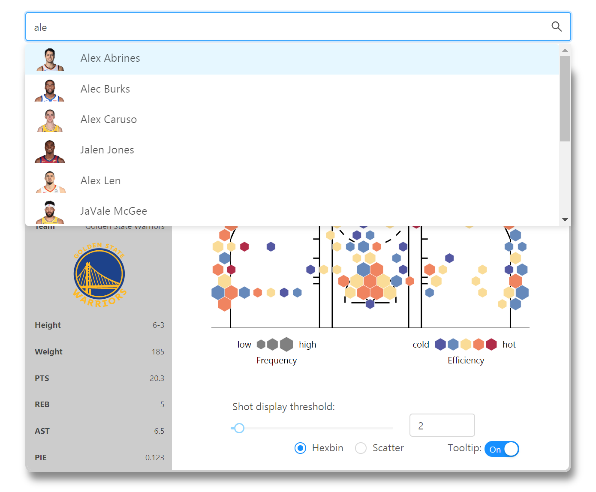

# NBAct: Reactjs based NBA player strength visualization

 ## Overview
 This project creates a dashboard that visualizes selected NBA players' strength via a shot chart and a profile view. Extra filters are implemented to support more customized visualization of the shot data, including adjustable shot display threshold, two selectable shot display themes (hexbin or scatter), and an option to enable tooltips that show shot efficiency. The webpage contains an autocomplete search bar that provides a list of relevant players with names and images according to varying search input.  
 
 The webpage is developed using Reactjs, d3 and Ant Design, and the player data is obtained from APIs provided by [stat.nba.com](https://stats.nba.com/). In details, the [d3-shotchart](https://www.npmjs.com/package/d3-shotchart) library is used to create the shotchart, the Ant Design [Autocomplete](https://ant.design/components/auto-complete/) component is adopted in the search bar, and the [nba](https://www.npmjs.com/package/nba) package is used to fetch and parse the raw data from [stat.nba.com](https://stats.nba.com/). The following diagram describes the structure and data flow between React components.
 
|  |
:-------------------------:
| <em>Structure and data flow between React components</em> | 
 
 ## Source Code
 [`src`](src) contains the HTML, CSS and JavaScript codes. 
 * [`components`](src/components) - classes of React components
 * [`styles`](src/styles) - CSS for the HTML elements corresponding to React components

## Usage
Use `npm` to install the packages needed in this project: `antd`, `lodash`, `nba` and `d3`. 
 
 ## Demo
|  |
:-------------------------:
| <em>Dashboard in hexbin display theme</em> |
|  |
| <em>Dashboard in scatter display theme</em> |
|  |
| <em>Autocomplete search bar</em> |

